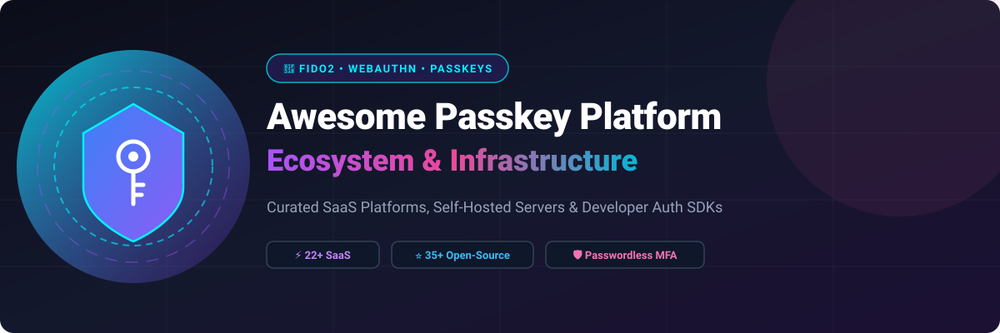

# 🔐 Awesome Passkey Management Platform

  
  
  
  
  
  

  

> **Curated List of SaaS Platforms & Open-Source Infrastructure for Passkeys, WebAuthn, FIDO2, Passwordless Authentication & Enterprise Credential Management.**

---

## 📑 Table of Contents
- [🚀 Overview](#-overview)
- [🏢 SaaS & Hosted Platforms](#-saas--hosted-platforms)
- [⭐ Open-Source & Self-Hosted Projects](#-open-source--self-hosted-projects)
- [🛠️ Developer WebAuthn & FIDO2 Libraries](#%EF%B8%8F-developer-webauthn--fido2-libraries)
- [📖 Architecture & Implementation Guide](#-architecture--implementation-guide)
- [🤝 How to Contribute](#-how-to-contribute)
- [⚖️ Disclaimer & Security Notice](#%EF%B8%8F-disclaimer--security-notice)
- [📈 Star History](#-star-history)

---

## 🚀 Overview

This repository tracks notable **SaaS/hosted platforms**, **enterprise identity services**, and **open-source projects** for **Passkey Management**. These tools help organizations and developers deploy, manage, synchronize, secure, and govern passwordless authentication based on **FIDO2** and **WebAuthn** standards.

Passkeys replace legacy passwords with phishing-resistant, public-key cryptographic credentials stored safely in hardware authenticators, operating systems, or secure credential vaults.

---

## 🏢 SaaS & Hosted Platforms

> 📊 **Market Insights**: The global Passwordless & Passkey Authentication market is estimated at **$15.8 Billion in 2026** (projected to reach $42+ Billion by 2030 at a 22% CAGR). The sector is **moderately fragmented**, with enterprise IAM leaders (Microsoft Entra, Okta, Cisco Duo, Ping/ForgeRock) governing workforce identity alongside fast-growing specialized passkey developer platforms (Stytch, Clerk, Descope) capturing modern application adoption.

The table below lists leading commercial SaaS products, sorted descending by **Company Size / Valuation**:

| Platform | Description | Pricing (Starting Tier) | Free Tier / Free Trial Limit | Company Size / Valuation |
|---|---|---|---|---|
| **Microsoft Entra ID** | Enterprise identity and access management ecosystem supporting passwordless authentication methods, passkeys/FIDO2 security keys, conditional access, and workforce identity management. | $6 / user / month (Entra ID P1 plan) | Free forever basic cloud directory up to 50,000 MAUs / objects | ~$3.4 Trillion (Microsoft Parent) / >$130B Cloud Rev |
| **Cisco Duo** | Enterprise authentication and MFA platform providing passwordless and phishing-resistant authentication options alongside device trust and access policy controls. | $3 / user / month (Essentials tier) | Free forever up to 10 users (or 30-day free trial) | ~$200 Billion (Cisco Parent) / ~$4.5B Security Rev |
| **Okta Customer Identity** | Enterprise identity platform offering passwordless authentication, WebAuthn, federation, MFA, lifecycle management, and customer identity capabilities. | $35 / month (Essentials tier) | Free forever up to 25,000 MAUs | ~$14 Billion (Okta, Inc.) / ~$2.5B ARR |
| **1Password Business** | Enterprise password-management platform increasingly focused on passwordless authentication, passkeys, secure credential sharing, access governance, and workforce security. | $8.99 / user / month (or $24.95/mo Teams plan) | 14-day free trial (full features) | ~$6.8 Billion / >$400 Million ARR |
| **Auth0 Passkeys** | Customer Identity and Access Management platform providing passkey and WebAuthn capabilities alongside social login, MFA, enterprise federation, and developer APIs. | $35 / month (B2C Essentials starting tier) | Free forever up to 25,000 MAUs | ~$6.5 Billion (Auth0 acquisition) |
| **Ping Identity** | Enterprise identity platform supporting passwordless authentication, federation, adaptive access, customer identity, and WebAuthn-based authentication. | $3 / user / month (PingOne Workforce Essential tier) | 30-day free trial (PingOne platform evaluation) | ~$2.8 Billion (Thoma Bravo acquisition) |
| **ForgeRock** | Enterprise identity platform ecosystem for large-scale workforce and customer identity deployments, including passwordless and FIDO/WebAuthn authentication capabilities. | $3 / user / month (via Ping Identity platform; or ~$35,000/year enterprise package) | 30-day free trial (via Ping Identity platform) | ~$2.3 Billion (Thoma Bravo acquisition) |
| **Transmit Security** | Identity security and customer authentication platform supporting passwordless authentication, identity orchestration, fraud reduction, and passkey-oriented experiences. | $50,000 / year (~$0.08 - $0.10 / MAU for Mosaic platform) | Free Developer Sandbox environment (API/SDK explorer) | ~$2.2 Billion - $3.0 Billion ($543M Series A) |
| **Yubico Enterprise** | Enterprise authentication ecosystem centered around hardware security keys and phishing-resistant authentication, including FIDO2/WebAuthn and passkey-compatible authentication workflows. | $45 / key (hardware) or ~$2.50 / user / month (YubiEnterprise Subscription, min 500 users) | Interactive online demo (demo.yubico.com) & sales-assisted enterprise PoC evaluation | ~$1.8 Billion (Market Cap) / ~$180M Rev |
| **Beyond Identity** | Passwordless identity platform emphasizing phishing-resistant authentication, cryptographic device credentials, and enterprise access security. | $6 / user / month (Workforce Advanced) or $0.016 / MAU | Free forever Developer Plan up to 10,000 MAUs | ~$1.1 Billion (Unicorn, $205M+ raised) |
| **Stytch** | Developer-focused authentication platform supporting passwordless authentication, passkeys, biometrics, OTP, OAuth, session management, and B2B identity workflows. | $0 / month pay-as-you-go ($0.005/MAU after free tier) | Free forever up to 10,000 MAUs (includes 5 SSO connections) | ~$1.0 Billion (Unicorn, $90M Series B) |
| **WorkOS** | Enterprise-ready developer platform for authentication and identity integrations, including SSO, directory synchronization, organizations, and modern authentication infrastructure. | $125 / connection / month (User auth free up to 1M MAUs) | Free forever up to 1,000,000 MAUs for AuthKit user management | ~$1.0 Billion (Unicorn, $80M Series B) |
| **Keeper Enterprise** | Enterprise password-management and privileged credential platform supporting secure vaults, credential sharing, administrative controls, secrets management, and passwordless technologies. | $6 / user / month (billed annually) | 14-day free trial (unlimited seats) | ~$1.0 Billion+ (Insight Partners investment) |
| **Bitwarden Enterprise** | Enterprise credential-management platform with open-source foundations, self-hosting options, passkey support, vault sharing, SSO integrations, and administrative controls. | $6 / user / month (billed annually) | Free forever for 2 users; 14-day free trial for Enterprise | ~$500 Million+ ($100M+ growth funding) |
| **OneLogin** | Cloud identity and access management platform offering SSO, MFA, directory integration, lifecycle management, and passwordless authentication capabilities. | $2 / user / month (Advanced SSO plan) | 30-day free trial | ~$500 Million (One Identity / Quest) |
| **Dashlane Business** | Enterprise password and credential management platform supporting passkey storage and management alongside SSO, SCIM, administrative controls, activity logging, and credential security features. | $8 / user / month (billed annually) | 14-day free trial (up to 10 seats, no credit card required) | ~$500 Million ($100M+ funding raised) |
| **Magic** | Passwordless authentication platform offering email, social, and Web3-oriented authentication infrastructure for applications. | $99 / month (Startup plan up to 2,500 MAWs) | Free forever up to 1,000 Monthly Active Wallets / Users | ~$500 Million ($80M+ funding raised) |
| **Descope** | Customer and workforce identity platform providing visual authentication flows, passwordless login, passkeys, MFA, federation, authorization, and developer integrations. | $249 / month (Pro plan) | Free forever up to 7,500 MAUs (up to 10 tenants) | ~$250 Million ($53M Series A) |
| **HYPR** | Enterprise identity assurance and passwordless authentication platform focused on phishing-resistant authentication, device identity, workforce access, and passwordless security. | $3 / user / month (Identity Assurance Access tier) | 30-day evaluation free trial / demo upon request | ~$200 Million ($70M+ funding raised) |
| **Clerk** | Developer authentication platform providing hosted user management, session handling, social login, enterprise SSO, and passwordless authentication features. | $25 / month (Pro plan base price) | Free forever up to 10,000 MAUs (or up to 50,000 MAUs on standard free tier) | ~$150 Million - $200 Million ($30M+ funding) |
| **Hanko Cloud** | Hosted authentication and user-management platform focused on modern authentication, including passkeys, passwords, MFA, social login, SAML SSO, and privacy-oriented deployment options. | $29 / month (Pro plan) | Free forever up to 10,000 MAUs (up to 2 production projects) | ~$15 Million - $20 Million ($3M+ seed) |
| **Passage** | Passwordless authentication platform from 1Password focused on passkeys and developer-friendly authentication experiences. | $249 / month (Growth plan at $0.05/MAU prior to retirement) | Free forever up to 1,000 MAUs (service retired Jan 2026) | Acquired by 1Password (Retired Jan 2026) |

---

## ⭐ Open-Source & Self-Hosted Projects

The open-source ecosystem provides powerful building blocks for organizations that prefer self-hosting or owning their authentication infrastructure.

Below is a curated list of active open-source identity, WebAuthn, FIDO2, and passkey projects, **sorted descending by GitHub Star Count**:

| Repository | Stars | Description | Ecosystem / Stack |
|---|---|---|---|
| **Vaultwarden** |  | Unofficial Bitwarden-compatible lightweight server written in Rust, widely used for self-hosted passkey and credential vault deployments. | Rust, SQLite / Postgres |
| **PocketBase** |  | Open-source real-time backend in a single file with built-in authentication, user management, and OAuth2 integration. | Go, SQLite |
| **Appwrite** |  | Open-source end-to-end backend server providing authentication, user management, OAuth, database, and functions. | TypeScript, Docker, PHP |
| **Keycloak** |  | Industry-standard open-source IAM supporting WebAuthn, passkeys, SSO, OIDC, SAML 2.0, LDAP, and enterprise federation. | Java, Quarkus |
| **Authelia** |  | Open-source single sign-on and two-factor authentication portal supporting WebAuthn passkeys, OIDC, and reverse proxy auth. | Go, TypeScript |
| **Authentik** |  | Open-source identity provider emphasizing modular flows, WebAuthn/FIDO2 MFA, SSO, OIDC, SAML, and Kubernetes readiness. | Python, Go |
| **Parse Server** |  | Open-source Node.js backend framework offering authentication, session management, and extensible user APIs. | Node.js, JavaScript |
| **Bitwarden Server** |  | Official open-source core backend for Bitwarden, enabling enterprise self-hosted credential vaults with passkey sync. | C#, .NET |
| **Ory Hydra** |  | Open-source OAuth 2.0 and OpenID Connect server designed for high-scale, cloud-native identity stacks. | Go |
| **SuperTokens** |  | Open-source developer authentication infrastructure providing passwordless, WebAuthn/passkey, sessions, and MFA. | Java, Node.js, Python |
| **ZITADEL** |  | Cloud-native open-source identity infrastructure with native FIDO2/WebAuthn passkeys, B2B multi-tenancy, OIDC, and SCIM. | Go |
| **Logto** |  | Open-source identity platform for SaaS products supporting passkeys, MFA, social sign-in, and multi-tenant organizations. | Node.js, TypeScript |
| **Casdoor** |  | UI-first open-source IAM platform supporting OAuth 2.0, OIDC, SAML, WebAuthn, social login, and multi-tenant management. | Go, React |
| **Ory Kratos** |  | Open-source cloud-native identity management system supporting WebAuthn passkeys, magic links, and customizable user flows. | Go |
| **Apereo CAS** |  | Enterprise open-source single sign-on server supporting WebAuthn, SAML, OIDC, OAuth, and legacy protocol integration. | Java, Spring Boot |
| **Hanko** |  | Modern open-source authentication system built ground-up for passkeys, WebAuthn, passkey-first UX, and self-hosting. | Go, TypeScript |
| **SpiceDB** |  | Open-source Zanzibar-inspired relationship-based access control (ReBAC) permission database. | Go |
| **Stack Auth** |  | Open-source developer auth platform providing Next.js / React authentication, passkey readiness, and user management. | TypeScript, Next.js |
| **Passbolt** |  | Open-source collaborative password and secret manager for teams, supporting self-hosting and GPG-encrypted sharing. | PHP, CakePHP |
| **Permify** |  | Open-source authorization service for building fine-grained relationship-based access control (ReBAC) system. | Go |
| **OpenFGA** |  | High-performance open-source Fine-Grained Authorization engine created by Okta and inspired by Google Zanzibar. | Go |
| **Ory Keto** |  | Open-source access control server implementing Google Zanzibar relationship-based access control (ReBAC). | Go |
| **Kanidm** |  | Modern open-source identity management server written in Rust with native WebAuthn/FIDO2 support and Linux integration. | Rust |
| **Cerbos** |  | Open-source policy-based authorization decision point enabling context-aware access policies. | Go |
| **Ory Oathkeeper** |  | Cloud-native open-source identity and access proxy for securing microservices and APIs. | Go |
| **Supabase Auth** |  | Open-source auth service powering Supabase, supporting JWT sessions, OAuth, magic links, and passwordless authentication. | Go |

---

## 🛠️ Developer WebAuthn & FIDO2 Libraries

Developers looking to integrate native WebAuthn and Passkey capabilities directly into their application backends can leverage these open-source libraries:

| Library | Stars | Description | Language |
|---|---|---|---|
| **SimpleWebAuthn** |  | Comprehensive TypeScript/Node.js library suite for building WebAuthn and Passkey registration and authentication. | TypeScript |
| **privacyIDEA** |  | Open-source multi-factor authentication system supporting WebAuthn, TOTP, YubiKey, and enterprise identity stores. | Python |
| **Go-WebAuthn** |  | Popular Go library for WebAuthn (FIDO2) registration and authentication in custom web applications. | Go |
| **Py_WebAuthn** |  | Python WebAuthn server library developed by Duo Labs for implementing FIDO2 passkey verification. | Python |
| **WSO2 Identity Server** |  | Open-source enterprise identity and access management platform supporting SSO, federation, OIDC, SAML, and WebAuthn. | Java |
| **WebAuthn-rs** |  | WebAuthn and FIDO2 server library written in Rust for high-security passwordless authentication. | Rust |
| **Janssen Project** |  | Open-source digital identity software platform built for high-scale enterprise authentication and FIDO2. | Python, Java |
| **WebAuthn4j** |  | Portable Java library for WebAuthn and FIDO2 server-side attestation and assertion verification. | Java |
| **Hanko Passkey Server** |  | Dedicated FIDO2-certified passkey server component for adding passkey authentication to existing backends. | Go |

---

## 📖 Architecture & Implementation Guide

When architectural teams adopt Passkey Management platforms, they typically select from four primary patterns:

1. **Full Identity Provider (IdP) SaaS**: Modern platforms like *Auth0, Stytch, Descope, Clerk, Okta* or *WorkOS* handle end-to-end user registration, passkey generation, session handling, and OAuth/OIDC flows.
2. **Self-Hosted Enterprise IAM**: Systems like *Keycloak, ZITADEL, Authentik* or *Authelia* provide full control over private infrastructure while supporting FIDO2/WebAuthn passkeys natively.
3. **Dedicated Passkey Middleware**: Standalone passkey engines (such as *Hanko Passkey Server* or custom *SimpleWebAuthn / Go-WebAuthn* microservices) hook into pre-existing legacy database authentication models.
4. **Hardware Key Management**: Enterprise security key distribution platforms like *Yubico Enterprise* manage lifecycle, logistics, and FIPS-compliant hardware authenticators for high-security environments.

---

## 🤝 How to Contribute

Contributions are welcome! Please follow these simple guidelines:

1. Fork this repository.
2. Add or update entries in [README.md](README.md) following the structured markdown tables.
3. Include factual details: platform name, documentation/GitHub links, clear description, pricing tier, free limits, and valuation/star badges.
4. Open a Pull Request with a short summary of changes.

---

## ⚖️ Disclaimer & Security Notice

This repository is a community-curated list for informational and evaluation purposes. 

- Passkey support and FIDO2 compliance vary across authenticators, operating systems, browsers, and enterprise identity providers.
- Production deployments of authentication infrastructure require thorough security reviews, audit logging, backup recovery mechanisms, and patch management.
- Always verify licensing models (especially for open-source vs. source-available software) before production deployment.

---

## 📈 Star History

---

  Made with ❤️ for developers, IAM architects, and security engineers building a passwordless future.

